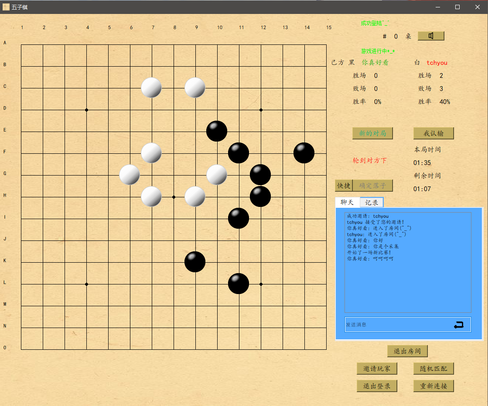
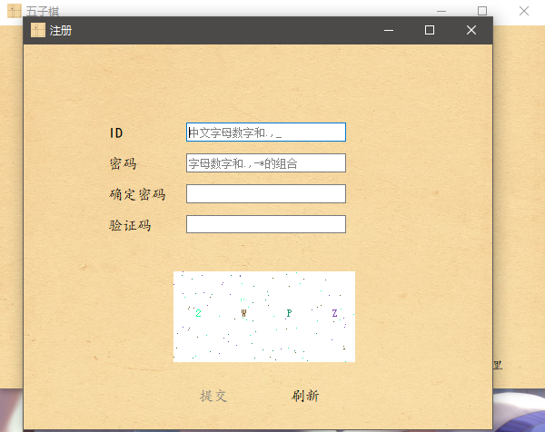
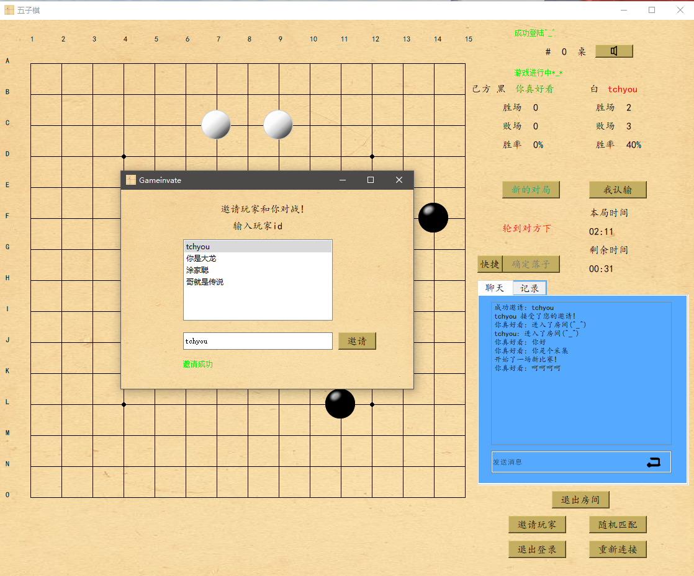

# This is a go game, player can play with other players.william 2018.

This is a Qt-c++ project build with visual sdudio, you can see solution file here.
It  may help you learn how to make a middle Qt project.
It could work corretly, though the construct of project is't such beautiful. 

# PICTURES

